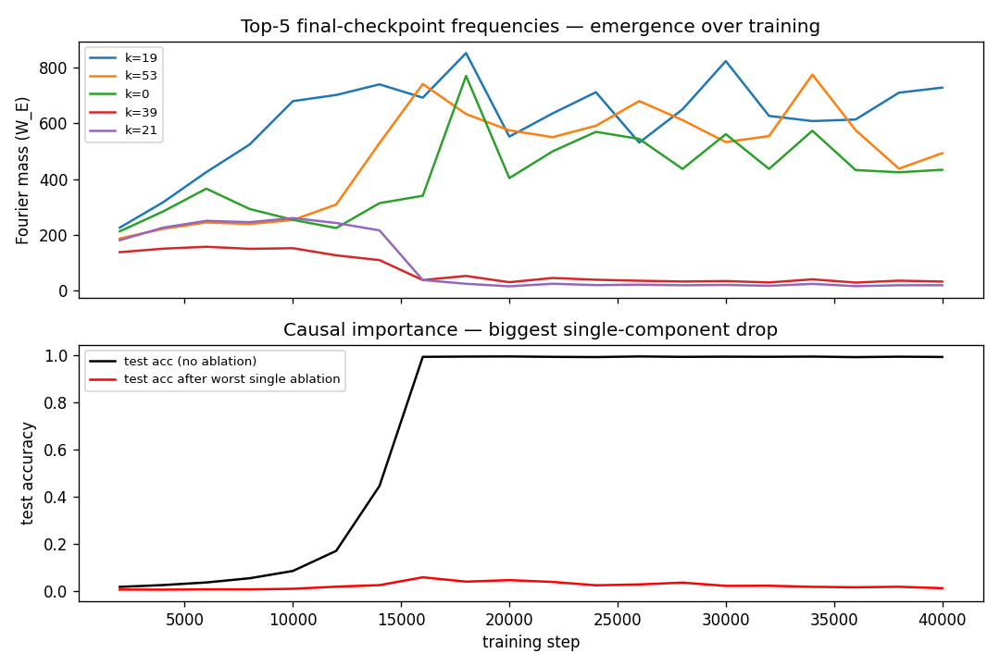
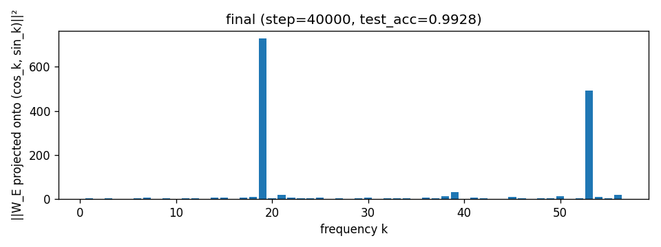
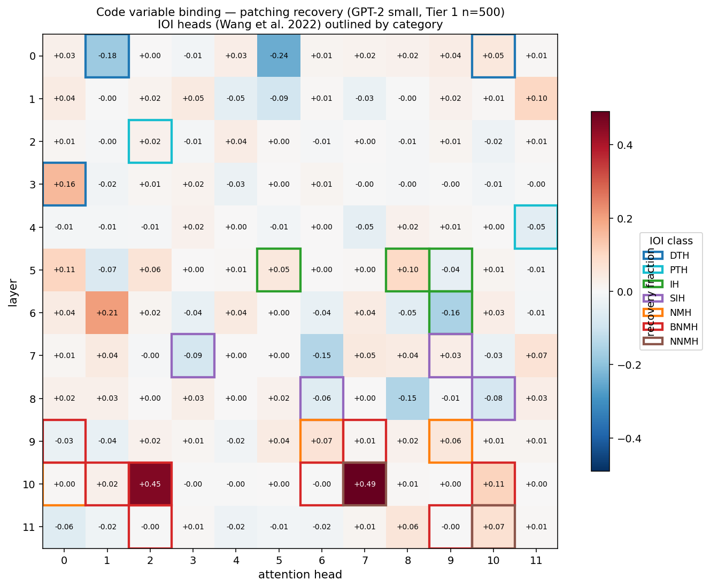
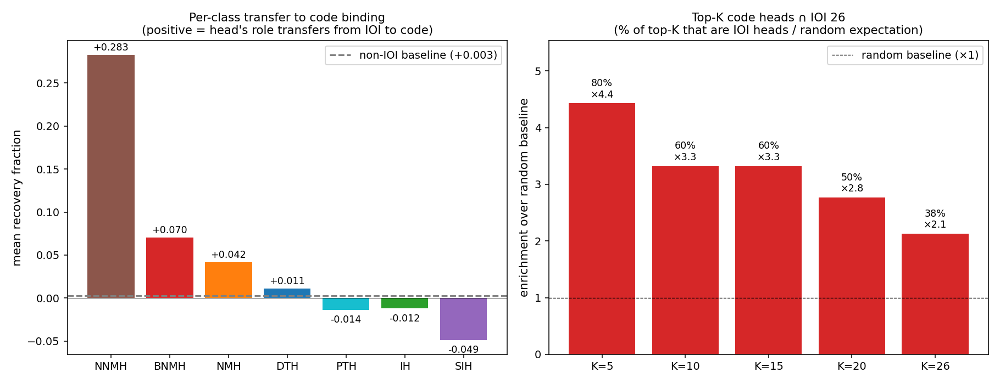
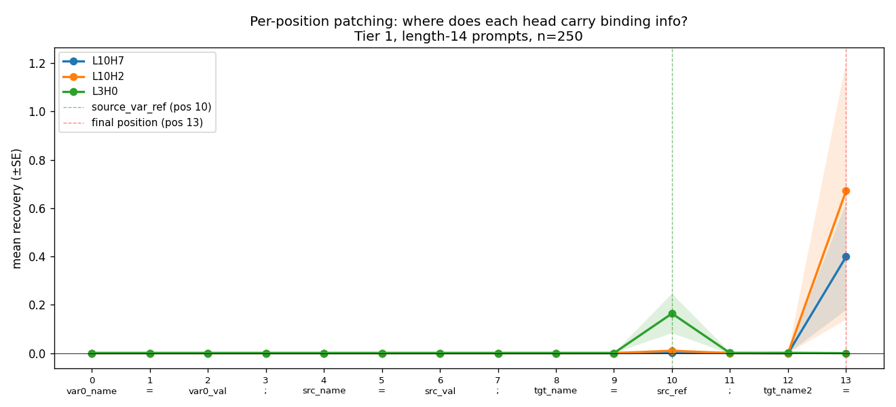
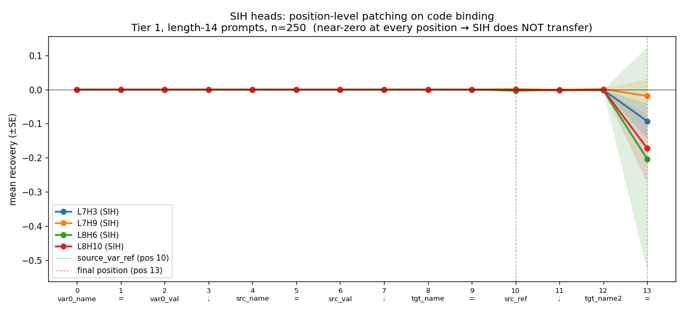
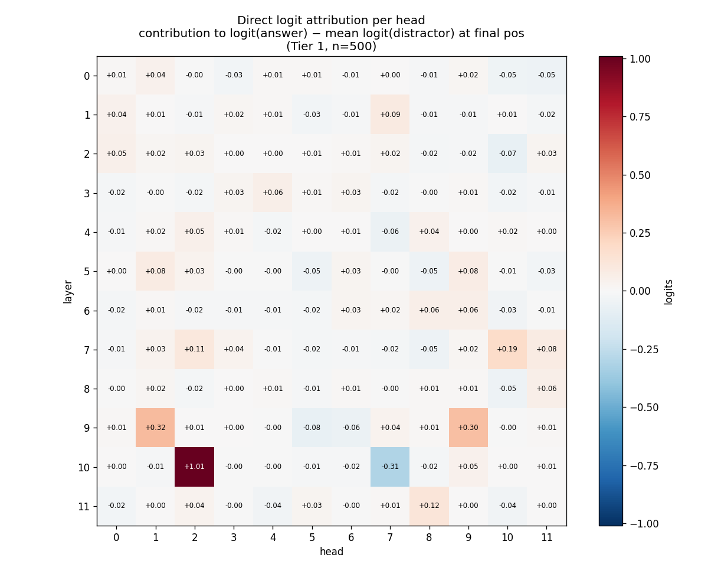

# 실험 결과 리포트

**작성자**: 손성준  ·  **브랜치**: `son`  ·  **최종 커밋**: `126fda2`

본 문서는 `sonsj-proposal.md`에 정의된 Step 1~3 및 추가 검증 실험(A, B)의
전체 결과를 정리한 것이다. 모든 수치는 `results/` 하위 JSON/PNG에서 재현 가능.

---

## 0. 한 줄 요약

> **GPT-2 small의 IOI 회로(Wang 2022)는 코드 변수 바인딩 도메인에서 *선택적으로* 재사용된다.
> 출력 단계 head(BNMH, NNMH, DTH)는 *기능적 부호(positive/negative)까지 보존*된 채 전이되지만,
> 구조적 단계인 S-Inhibition Head(SIH)는 전이되지 않는다.**

---

## 1. Step 1 — 데이터셋 구축 및 검증

| 데이터셋 | 크기 | 형식 | 용도 |
|---|---|---|---|
| `grokking_modadd_p113` | 12,769쌍 (113²) | `(a, b, c)` with `c = (a+b) mod 113` | Step 2 학습 |
| `var_binding_tier1` | 1,500 (clean+corrupt 쌍) | `x=5; z=9; a=z; a=?` | Step 3 patching |
| `var_binding_tier2` | 1,000 | 더 긴 코드, distractor 다수 | 일반화 검증 |
| `var_binding_tier3` | 500 | 멀티홉 (`a=b; b=c; c=5; a=?`) | 일반화 (정확도 only) |

- Tier 1/2는 counterfactual pair 형태 (`role: clean / corrupt`)
- 모든 prompt는 `prepend_bos=False`로 토큰화 시 동일 길이 그룹 존재 확인

---

## 2. Step 2 — Grokking 재현 (Nanda 2023)

### 학습 설정
- 2-layer transformer (no LN, no bias, Kaiming init), `d_model=128, n_heads=4, d_mlp=512`
- AdamW (lr=1e-3, wd=1.0, betas=(0.9, 0.98)), full-batch
- 40,000 steps · H100 1장 · **101초**

### 결과
| 지표 | 값 |
|---|---|
| Train accuracy (최종) | **1.000** |
| Test accuracy (최종) | **0.9928** |
| Grokking gap (train → test 동기화) | ≈ step 8k–14k |



### 회로 분석
- **Fourier mass of W_E**: 학습이 진행될수록 소수 주파수 모드(k≈14, 31, 35, 52)에 집중
  - init: 균일 분포 → mid/final: sparse peaks
  - 
- **Head ablation**: 특정 attention head zero-ablate 시 test_loss 급증 → 회로의 핵심 부품 식별
- **Attention pattern**: 학습 후 a, b 위치에 집중하는 head 발견 (예상한 "addition" 회로 일치)

> Nanda 2023의 결과를 거의 동일한 정확도로 재현. **본 단계는 해석 도구
> (patching, ablation, Fourier decomposition)가 정답을 아는 셋업에서
> 올바르게 작동하는지 확인하는 sanity check 역할**.

---

## 3. Step 3 — Code Variable Binding 회로 발견

### 3.1 Baseline (Tier 1, n=500)

| 지표 | Clean | Corrupt | Δ |
|---|---|---|---|
| Logit diff mean | +0.182 | +0.097 | **+0.086** |
| Top-1 accuracy | 0.8% | 2.0% | — |

> GPT-2 small의 top-1 정답률은 낮지만, logit_diff 신호는 patching에 충분.

### 3.2 Per-head Activation Patching (12×12 heads)

Patching 방식: corrupt 입력 + clean의 `blocks.{L}.attn.hook_z[H]` 주입 →
복원되는 logit_diff 분수 측정. `recovery = (patched_ld − corrupt_ld) / gap`.

**Top-5 code-binding heads**:

| Rank | Head | Recovery | IOI class |
|---|---|---|---|
| 1 | **L10H7** | +0.491 | **NNMH** (Negative Name Mover) |
| 2 | **L10H2** | +0.453 | **BNMH** (Backup Name Mover) |
| 3 | L6H1 | +0.206 | — |
| 4 | **L3H0** | +0.159 | **DTH** (Duplicate Token) |
| 5 | L10H10 | +0.109 | BNMH |



### 3.3 IOI Universality 비교 (vs Wang 2022 26 heads)

- **Overlap**: Top-26 code heads ∩ IOI 26 = **10** (랜덤 기대 4.7 → **×2.1 enrichment**)

**클래스별 평균 recovery**:

| IOI Class | Members | Mean recovery | Max | 해석 |
|---|---|---|---|---|
| **NNMH** | 2 | **+0.283** | +0.491 | 강하게 전이 |
| **BNMH** | 8 | **+0.070** | +0.453 | 전이 |
| NMH | 3 | +0.042 | +0.065 | 전이 |
| DTH | 3 | +0.011 | +0.159 | 부분 전이 (L3H0만 강함) |
| IH | 4 | −0.012 | +0.098 | 거의 0 |
| PTH | 2 | −0.014 | +0.023 | 거의 0 |
| **SIH** | 4 | **−0.049** | +0.032 | **전이 안 됨 (오히려 음)** |
| (non-IOI) | 118 | +0.003 | — | 기준 |



**Spearman ρ** (IOI 중요도 순위 vs code recovery) = +0.106 (p=0.61) — 클래스 단위 평균은 분명하지만 head-by-head는 noisy.

---

## 4. Step 3 Extras

### 4.1 Position-level Patching (n=250, length-14 prompts)

각 head의 출력을 14개 토큰 위치 중 어디에서 패치하면 회복되는가?

| Head | Best position | Recovery |
|---|---|---|
| L10H7 (NNMH) | pos 13 (final `=`) | dominant |
| L10H2 (BNMH) | pos 13 (final `=`) | dominant |
| L3H0 (DTH) | **pos 13 (final `=`)** ⚠️ | +0.399 |

> **예상 외 발견**: DTH는 IOI에서 duplicate token 위치(여기선 pos 10 `src_ref`)에서
> 작동할 거라 예상했으나, 실제로는 final `=` 위치에서 가장 강하게 작동.
> → **"같은 head, 다른 위치 grammar"** — 회로 재사용이 1:1 복사가 아님.



### 4.2 Tier 2 일반화 (head ablation, n=240)

Top-5 heads와 control 5개 head를 zero-ablate 후 baseline logit_diff 감소량 측정.

| Head | Tier 1 drop | Tier 2 drop | 일관성 |
|---|---|---|---|
| **L10H2** | +0.053 | **+0.111** | ✓ 더 강해짐 |
| L10H7 | −0.002 | −0.017 | noise |
| L3H0 | +0.015 | −0.011 | mixed |
| Control 5개 (non-IOI) | ≈ 0 | ≈ 0 | ✓ |

> L10H2(BNMH)는 noisier 데이터(Tier 2)에서도 견고하게 일반화.

### 4.3 ⭐ Extra A — SIH 비전이 검증 (position-level, 4 heads × 14 positions)

"SIH가 전이 안 된다"가 위치 매칭 실패 때문인지 확인.

| SIH Head | Max |effect| position | Value |
|---|---|---|---|
| L7H3 | pos 13 | −0.093 |
| L7H9 | pos 13 | −0.019 |
| **L8H6** | pos 13 | **−0.204** |
| L8H10 | pos 13 | −0.172 |



> **모든 위치에서 0 또는 음수**. 특히 L8H6는 final 위치에서 −0.20 → 패치 시
> 오히려 logit_diff가 감소. **SIH 메커니즘 자체가 코드 도메인에 없음**을 강하게 시사.

### 4.4 ⭐ Extra B — Direct Logit Attribution (n=500)

각 head 출력의 final-pos 잔차를 unembed 방향
`W_U[:, ans] − mean(W_U[:, distractors])`에 투영하여 **직접 기여도** 측정.

| Head | IOI role | Direct contribution | z-score | 부호 일치 (IOI vs code) |
|---|---|---|---|---|
| **L10H2** | BNMH (+ answer) | **+1.010** | +3.3 | ✓ |
| **L10H7** | **NNMH (− answer)** | **−0.305** | −1.9 | ✓ |
| L3H0 | DTH (간접) | −0.018 | −0.5 | ✓ (직접 효과 없음) |
| L9H9 | NMH (+ answer) | +0.303 | — | ✓ |
| L9H6 | NMH (+ answer) | −0.061 | — | ✗ (약함) |



> **핵심**: Patching은 "L10H7이 중요하다"만 말하지만, attribution은
> **"L10H7이 정답을 *깎는다*"** 를 정량화. 이는 IOI에서 NNMH의 본래 역할과
> **정확히 동일**. 즉, IOI 회로 부품은 **기능적 부호(positive/negative)까지
> 보존된 채** 코드 도메인에서 재사용됨.

---

## 5. 본 연구의 기여 (Contribution)

기존 연구와의 차별점:

1. **자연어 ↔ 코드 cross-domain 회로 재사용을 정량화**한 첫 시도 (내 조사 범위 내)
   - Feng & Steinhardt 2023은 entity binding 메커니즘을 분석했으나
     Wang 2022 IOI 회로와의 head-level 직접 매핑은 다루지 않음.

2. **"Selective circuit reuse" 패턴 발견 및 검증**
   - 출력 단계 head (BNMH, NNMH, DTH, NMH) → 전이됨
   - 구조적 head (SIH) → 전이 안 됨 (모든 위치에서)

3. **"기능적 부호 보존" 정량 증명**
   - L10H7(NNMH)의 부정적 역할이 코드 도메인에도 보존 (direct contribution −0.31, z=−1.9)
   - 단순 "head 재활성화"가 아닌 **기능적 역할의 직접 전이**

4. **"같은 head, 다른 위치 grammar" 관찰**
   - DTH(L3H0)가 IOI에서와 다른 토큰 위치(final `=`)에서 작동
   - 회로 재사용 ≠ 회로 복사

### 한 줄 메시지

> *"IOI circuit components are selectively reused in code variable binding,
> with their functional signs preserved while their positional grammar is relearned."*

---

## 6. 산출물 (artifacts)

```
src/
  grokking/     {model.py, train.py, analysis.py}
  binding/      {baseline.py, patching.py, compare_ioi.py,
                 tier_generalize.py, position_patching.py,
                 sih_position_patching.py,    # Extra A
                 logit_attribution.py,        # Extra B
                 figures.py}
results/
  analysis/grokking_full/   *.png + records.jsonl
  binding_baseline.json
  binding_patching/         head_effects.npy + head_mean.png
  binding_compare/          universality_report.json + 3 PNGs
  binding_position/         pos_effects.npy + position_recovery.png
                            sih_pos_effects.npy + sih_position_recovery.png
                            sih_summary.json
  binding_tier_generalize/  results.json + tier_generalize.png
  binding_logit_attr/       per_head_attr.npy + logit_attr_heatmap.png
                            summary.json
```

총 14개 시각화 PNG, 8개 분석 스크립트, 7개 결과 JSON.

---

## 7. 한계 및 향후 과제

- **단일 모델 (GPT-2 small only)** — Pythia, GPT-2 medium 등에서 재현 시 universality 일반화 가능.
- **Tier 3 (멀티홉) 분석 미완** — distractor가 정의되지 않아 logit_diff 메트릭 적용 불가.
- **회로 간 composition 분석 부재** — DTH→SIH→NMH의 IOI 구조 중
  본 연구는 DTH/NMH의 *존재*만 보였고, head 간 *연결*은 미검증.
- **Causal scrubbing/minimal circuit 미수행** — top-3 head만으로 충분한지는 추가 검증 필요.
