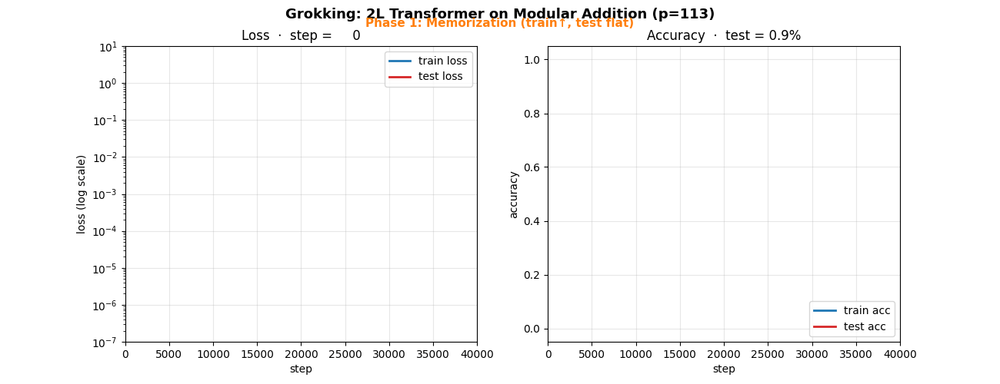
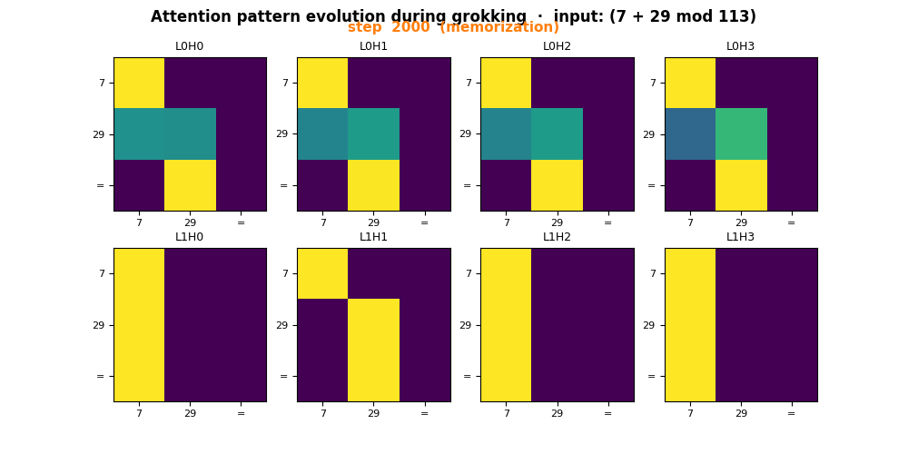
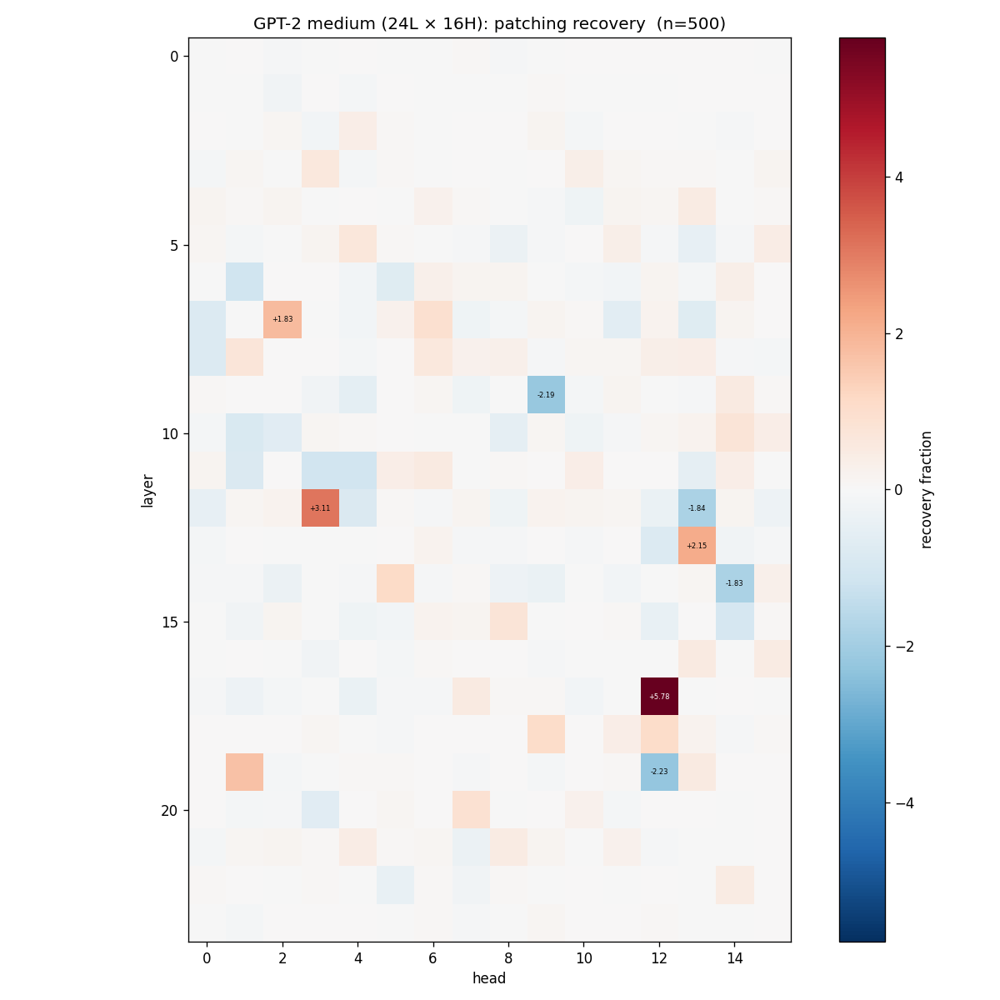

# Transformer Circuit Analysis
## Grokking과 Code Variable Binding

**손성준** ·  Deep Learning Term Project ·  2026

*Mechanistic Interpretability* — 트랜스포머 내부 회로를 reverse-engineering

---

## 한 줄 요약

> **GPT-2 small의 IOI 회로(Wang 2022)는 코드 변수 바인딩 도메인에서**
> **선택적으로 재사용되며, 재사용되는 head는 기능적 부호(±)까지 보존된다.**

추가로:
- Pythia-160M, GPT-2 medium 재현 → universality는 *해부학적*이 아닌 *기능적* 수준
- 큰 모델일수록 **회로 redundancy 증가** → 단순 ablation으로 깨지지 않음

---

## 왜 이 주제인가?

**Mechanistic Interpretability (MI)** — 모델 내부 회로를 알고리즘 수준에서 이해

- MIT Tech Review 2026 "10 Breakthrough Technologies" 선정
- Dario Amodei (Anthropic CEO): *"The Urgency of Interpretability"* (2025)
- NeurIPS/ICLR/ICML 전용 워크샵 (2024~2026)

**핵심 질문**: *Transformer가 코드의 variable binding과 자연어의 entity binding을
같은 회로로 처리하는가, 다른 회로로 처리하는가?*

→ **Circuit Universality 가설** (Olah 2020, Chughtai 2023)을 modality 간 첫 검증

---

## 비교 대상: 구조가 같은 두 task

| 자연어 IOI (Wang 2022) | 코드 Variable Binding |
|---|---|
| "Mary and John went to the store. John gave a drink to **?**" | `x=5; z=9; a=z; a=?` |
| 정답: Mary | 정답: 9 |
| Entity 2개 중 binding 추적 | 변수 2개 중 binding 추적 |

> **표면 형태는 다르지만 추상 구조는 동일** → 같은 회로 쓰면 universality 증거

---

## 진행 단계

| Step | 내용 | 산출물 |
|---|---|---|
| **1** | 데이터셋 구축 (grokking + var binding tier 1~3) | 6개 데이터셋 |
| **2** | Grokking 재현 (Nanda 2023) | 40k step 학습 + 회로 분석 |
| **3** | GPT-2 small에서 binding 회로 발견 + IOI 비교 | 핵심 결과 |
| **3+** | Extras A~F: SIH, logit attribution, minimal circuit, cross-model | **7개 추가 발견** |
| **4** | 시각화 + 발표 | 본 슬라이드 |

---

## Step 2 — Grokking 재현

- 2-layer transformer (no LN, no bias, d=128), modular addition (p=113)
- AdamW + full batch, 40,000 steps · **101초 on H100**
- Train acc **1.000**, Test acc **0.9928**

> Phase 1 (memorization) → Phase 2 (grokking 전환) → Phase 3 (generalized)

---

## Step 2 — Grokking 회로

**Fourier mass of $W_E$**: 학습 진행에 따라 소수 주파수 모드(k≈14, 31, 35, 52)에 집중

**Attention pattern 진화**:

> Nanda 2023의 회로(sin/cos 기반 modular addition 알고리즘)를 재현
> ⇒ **해석 도구(patching, ablation, Fourier)가 정답이 알려진 셋업에서 옳게 작동함 검증**

---

## Step 3 — Code Variable Binding 회로 발견

**Baseline (Tier 1, n=500)**: clean logit_diff +0.182, corrupt +0.097, **gap +0.086**

**Per-head activation patching → Top-5 binding heads**:

| Rank | Head | Recovery | IOI class (Wang 2022) |
|---|---|---|---|
| 1 | **L10H7** | +0.491 | **NNMH** (Negative Name Mover) |
| 2 | **L10H2** | +0.453 | **BNMH** (Backup Name Mover) |
| 3 | L6H1 | +0.206 | — |
| 4 | **L3H0** | +0.159 | **DTH** (Duplicate Token) |
| 5 | L10H10 | +0.109 | BNMH |

→ Top-5 중 4개가 IOI 26 head에 해당 (랜덤 기대 4.7/26 → **×2.1 enrichment**)

---

## Step 3 — IOI Universality 정량화

IOI 회로 26 head를 클래스별로 outline (DTH, IH, SIH, NMH, BNMH, NNMH, PTH)

---

## Step 3 — Class별 전이 패턴

| Class | Mean recovery | 전이? |
|---|---|---|
| NNMH (출력 ↓ distractor) | **+0.283** | ✓ 강하게 |
| BNMH (출력 ↑ answer) | **+0.070** | ✓ |
| NMH, DTH | +0.04, +0.01 | ✓ 부분 |
| **SIH (S-Inhibition)** | **−0.049** | **✗ 전이 안 됨** |

> **선택적 재사용** — 출력 단계 ✓ / 구조적 단계 ✗

---

## Extra A — SIH 비전이 검증

"SIH가 전이 안 된다"가 **위치 매칭 실패** 때문인지 확인 — 14개 위치 모두 검사

> **모든 위치에서 0 또는 음수** (L8H6: −0.20 @ pos 13)
> → SIH 메커니즘 자체가 코드 도메인에 부재

---

## Extra B — Direct Logit Attribution

각 head 출력의 final-pos 잔차를 $W_U[\text{ans}] - W_U[\overline{\text{dist}}]$ 방향에 투영

| Head | IOI role | Direct contribution | z |
|---|---|---|---|
| **L10H2** | BNMH (+) | **+1.010** | **+3.3** |
| **L10H7** | **NNMH (−)** | **−0.305** | **−1.9** |
| L3H0 | DTH (간접) | −0.018 | −0.5 |
| L9H9 | NMH (+) | +0.303 | — |

> **L10H7이 정답을 *깎는* 역할 — IOI에서 NNMH의 본래 기능과 *정확히* 동일**
> → **기능적 부호(±)까지 보존된 재사용**

---

## Extra F — Minimal Circuit (Necessity Test)

| Ablate | drop | Random K drop | 배수 |
|---|---|---|---|
| top3 | +0.054 | +0.031 ± 0.070 | ×1.7 |
| **top5** | **+0.051** | +0.005 ± 0.038 | **×10** |
| top10 | +0.065 | +0.035 ± 0.043 | ×1.9 |
| **ioi26** | **+0.116** | +0.046 ± 0.054 | **×2.5** |

Attention 전체 기여 = +0.133

> **IOI-26 (144 head 중 18%) 제거 = attention 기여의 87% 소실**
> → 코드 binding attention 회로 ⊂ IOI 회로 (sub-circuit)

---

## Extra D — Cross-Model Replication

같은 12L × 12H지만 완전히 다른 모델: **Pythia-160M** (rotary, parallel attn+MLP, Pile)

| 측면 | GPT-2 small | Pythia-160M |
|---|---|---|
| Attn 전체 기여 | +0.133 | +0.145 |
| Top head recovery | +0.49 (L10H7) | **+1.01 (L5H9)** |
| Layer peak | **L10–11 (83–92%)** | **L5–6 (42–50%)** |
| Top-10 coord overlap | — | 1/10 (random ≈ 0.7) |
| Necessity (top-10) | +0.116 (×1.9) | +0.073 (**×15**) |

> Universality가 **4축으로 분해**됨

---

## Extra D2 — GPT-2 Medium 추가

| | GPT-2 small | **GPT-2 medium** | Pythia-160M |
|---|---|---|---|
| Layers × Heads | 12×12 | **24×16** | 12×12 |
| Layer peak (%) | 83–92% | **71–75%** | 42–50% |
| Top head recovery | +0.49 | **+5.78** | +1.01 |
| Ablate top-10 drop | +0.116 | **−0.121 (helps!)** | +0.073 |

**GPT-2 family**: layer 위치 70~90%로 일관 (architectural consistency)
**Pythia**: 45%로 완전히 다름 (family 효과)

---

## ⭐ 새 발견: Scale-dependent Hydra Effect

GPT-2 medium에서 top-K head 제거 시 **logit_diff가 오히려 증가** (−0.121)

→ Wang 2022 IOI의 "Backup Name Mover hydra effect"가 큰 모델에서 *과보상*까지 일어남
→ **메서드론적 함의**: 큰 모델에서 zero-ablation의 한계, path patching 필요

---

## Universality의 4단계 분해

| 축 | GPT-2 small | GPT-2 medium | Pythia-160M | 보존? |
|---|---|---|---|---|
| ① Functional concentration | ✓ | ✓ | ✓ | **모두 ✓** |
| ② Causal necessity | ×1.9 | hydra | ×15 | **모두 ✓** |
| ③ Layer-stage location | 83–92% | 71–75% | **42–50%** | family 내 ✓, 간 ✗ |
| ④ Head coordinate | — | (다른 width) | 1/10 | **✗ random** |

> **"같은 원리, 다른 해부학적 위치"**
> Universality는 architecture 표면이 아닌 functional decomposition 수준에서 성립

---

## 본 연구의 기여 (Contribution) 1/2

1. **NL ↔ Code cross-domain 회로 재사용을 정량화한 첫 시도**
   - 선행 연구(Feng & Steinhardt 2023)는 binding 메커니즘은 봤지만 IOI 회로와 매핑 X

2. **"Selective circuit reuse" 패턴 발견·검증**
   - 출력 단계 (BNMH, NNMH, DTH) ✓ / 구조적 단계 (SIH) ✗

3. **"기능적 부호 보존" 정량 증명**
   - NNMH의 negative 역할이 코드 도메인에도 그대로 (direct attribution −0.31, z=−1.9)

4. **"같은 head, 다른 position grammar" 관찰**
   - DTH(L3H0)가 IOI와 다른 위치(final `=`)에서 작동

---

## 본 연구의 기여 (Contribution) 2/2

5. **회로 크기 정량화** — IOI-26 (18%)이 attention 기여의 87% 담당
   → 코드 binding 회로 = IOI 회로의 sub-circuit

6. **Cross-model universality 4단계 분해**
   - ① Functional ✓ / ② Necessity ✓ / ③ Layer ~family ✓, between ✗ / ④ Coord ✗

7. **Scale-dependent hydra effect** (신규 발견)
   - GPT-2 medium에서 top-K ablation이 성능 향상 (−0.121)
   - 큰 모델일수록 redundancy 증가 → 메서드론적 경고

---

## 이 연구의 의미 (So What)

**학술적 의미**
- Circuit Universality 가설의 **정밀화** — "전이된다/안 된다" 이분법 → **부품 단위 분해**
- 같은 *좌표*가 아니라 같은 *역할*이 전이된다는 **기능적 universality**의 데이터 근거

**실용적 의미**
- 코드 fine-tuning이 자연어 능력에 영향 가능 — 출력 회로(NMH/NNMH) 공유
- 큰 모델 해석에 단순 ablation은 위험 — hydra로 인한 오해석, path patching 필요

---

## 차별화 — 선행 연구 대비

| 선행 연구 | 한 일 | 본 연구가 추가 |
|---|---|---|
| Wang 2022 (IOI) | 자연어 26 head 회로 발견 | **코드에서도 작동하는지 첫 검증** |
| Feng & Steinhardt 2023 | binding 메커니즘 분석 | **IOI 회로와 head-level 매핑** |
| Chughtai 2023 | toy model universality 제안 | **실제 모델·task·modality 정량 검증** |
| 일반 universality 논의 | "전이/비전이" 이분법 | **4축 분해** |

**고유 발견 3가지**: ① 기능적 부호 보존 · ② Selective reuse 비대칭성 · ③ Scale-dependent hydra

> **기존이 회로를 "있다/없다"로 봤다면, 본 연구는 부품·기능·인과·해부학 축으로 쪼개**
> **무엇이 도메인·모델을 넘어 전이되는지를 처음으로 다차원 정량화했다.**

---

## 한계 및 향후 과제

- **Hydra mechanism 미규명** — 어떤 backup head가 활성화되는지 path patching 필요
- **Tier 3 multi-hop 분석 부분 미완** — distractor 정의 불가
- **더 큰 모델 (Llama, Mistral)** 으로 확장 시 universality framework 일반화 가능
- **Causal scrubbing** — 완전한 sufficiency 검증

---

## 산출물

**`son` branch · ~3시간 GPU (H100) · 모델 3종**

- 17개 분석 스크립트 (`src/{grokking,binding}/`)
- 17+ 시각화 PNG + 2 GIF + wandb 차트 5
- 8 결과 JSON + 5 raw `.npy` + 2 CSV
- `docs/results.md` (상세) · `docs/report.md` (장표용) · 본 슬라이드

GitHub: https://github.com/yesulmin-danbaaam/Deep-learning-Term-project/tree/son

---

# 감사합니다

질문 환영합니다.

**참고문헌**
- Nanda et al. 2023, *Progress Measures for Grokking*. ICLR.
- Wang et al. 2022, *Interpretability in the Wild (IOI)*. ICLR.
- Chughtai et al. 2023, *A Toy Model of Universality*. ICML.
- Feng & Steinhardt 2023, *How do LMs Bind Entities*.
- Bereska & Gavves 2024, *Mech Interp Review*. arXiv:2407.02646.
